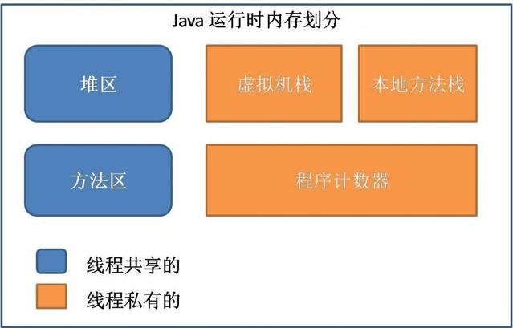

# 运行时数据区域
Java虚拟机在执行Java程序的过程中会把它所管理的内存划分为若干个不同的数据区域。这些区域都有各自的用途，以及创建和销毁时间，有的区域锁着虚拟机进程的启动而存在，有些区域则依赖用户线程的启动和结束而建立和销毁。根据《Java虚拟机规范（Java SE 7版）》，Java虚拟机所管理的内存将会包括以下几个运行时数据区域。

## 程序计数器
程序计数器属于**线程私有的数据区域**，是一块较小的内存空间，可以看做是当前线程所执行的字节码的行号指示器。在虚拟机的概念模型里，字节码解释器工作时就是通过改变这个计数器的值来选取下一条需要执行的字节码指令，分支、循环、跳转、异常处理、线程回复等基础功能都需要依赖这个计数器来完成。

如果线程正在执行的是一个Java方法，这个计数器记录的是正在执行的虚拟机字节码指令的地址；如果正在执行的是Native方法，这个计数器值为空（Undefined）。**此内存区域是唯一一个在Java虚拟机规范中没有规定任何OutOfMemoryError情况的区域**。
## Java虚拟机栈
Java虚拟机栈属于**线程私有的数据区域**，它的生命周期与线程相同。虚拟机栈描述的是Java方法执行的内存模型：每个方法在执行同时都会创建一个栈帧（Stack Frame）用于存储局部变量表、操作数栈、动态链接、方法出口等信息。每一个方法从调用直至执行完成的过程，就对应着一个栈帧在虚拟机栈中入栈到出栈的过程。

局部变量表存放了编译器克制的各种基本数据类型（boolean、byte、char、short、int、float、long、double）、对象引用和returnAddress类型。局部变量表所需的内存空间在编译期间完成分配，当进入一个方法时，这个方法在帧中分配多大的局部变量空间是完全确定的，在方法运行期间不会改变局部变量表的大小。

在Java虚拟机规范中，对这个区域规定了两种异常状况：如果线程请求的栈深度大于虚拟机所允许的深度，将**抛出StackOverflowError异常**；如果虚拟机栈可以动态扩展（当前大部分Java虚拟机都是可以动态扩展，只不过Java虚拟机规范中也允许固定长度的虚拟机栈），但是扩展时无法申请到足够的内存，就会**抛出OutOfMemoryError异常**。
## 本地方法栈
本地方法栈属于**线程私有的数据区域**，与虚拟机栈所发挥的作用非常相似，它们之间的区别不过是虚拟机栈为虚拟机执行Java方法服务，而本地方法栈为虚拟机使用到的Native方法服务。与虚拟机栈一样，本地方法栈区域也**抛出StackOverflowError和OutOfMemoryError异常**。

## Java堆
Java堆属于**线程共享的数据区域**，是Java虚拟机所管理的内存中最大的一块。在虚拟机启动时创建。此内存区域的唯一目的就是存放对象实例，几乎所有的对象实例都在这里分配内存（随JIT编译技术和逃逸分析技术发展，少量对象实例可能在栈上分配）。Java堆是垃圾收集器管理的主要区域，因此很多时候也被称作“GC堆”。

从内存回收的角度来看，由于现在收集器基本都采用分代收集算法，所以Java堆中还可以细分为：新生代和老年代；再细致一点的有Eden空间、From Survivor空间、To Survivor空间等。

从内存分配的角度来看，线程共享的Java堆中可能划分出多个线程私有的分配缓冲区（Thread Local Allocation Buffer, TLAB）

Java堆可以处于物理上不连续的内存空间中，只要逻辑上是连续的即可。在实现时，既可以实现成固定大小的，也可以是可扩展的，不过当前主流的虚拟机都是按照可扩展来实现的（通过-Xmx和-Xms控制）。如果在堆中没有内存完成实例分配，并且堆也不能在扩展时，将**抛出OutOfMemoryError异常**。

## 方法区
方法区术语**线程共享的数据区域**，用于存储已被虚拟机加载的类信息、常量、静态变量、即时编译器编译后的代码等数据。对于习惯在HotSpot虚拟机上开发、部署应用程序的开发者来说，很多人更愿意把方法区称为“永久代”，但是本质上，两者并不等价。

当方法区无法满足内存分配需求时，将**抛出OutOfMemoryError异常**。
### 运行时常量池
运行时常量池（Runtime Constant Pool）是方法区的一部分。Class文件中除了有类的版本、字段、方法、接口等描述信息外，还有一项信息是常量池，用于存放编译器生成的各种字面量和符号引用，这部分内容将在类加载后存入方法区的运行时常量池中存放。一般来说除了保存Class文件中符号引用外，还会把翻译出来的直接引用也存放在运行时常量池中。

运行时常量池相对于Class文件常量池的林外一个重要特性是具备动态性，Java语言并不要求常量一定只有编译期间才能产生，也就是并非预置如Class文件中常量池的内容才能进入方法区运行时常量池，运行期间也可能将新的常量放入池中，例如String类的intern()方法。

当常量池再也无法申请到内存是会**抛出OutOfMemoryError异常**。

## 直接内存
直接内存不是虚拟机运行时数据区的一部分，也不是Java虚拟机规范中定义的内存区域。在JDK 1.4中新加入了NIO（New Input/Output）类，引入了一种基于通道（Channel）与缓冲区（Buffer）的I/O方式，它可以使用Native函数库直接分配堆外内存，然后通过一个存储在Java堆中的DirectByteBuffer对象作为这块内存的引用进行操作。这样能在一些场景中显著提高性能，因为避免了再Java堆和Native堆中来回复制数据。
