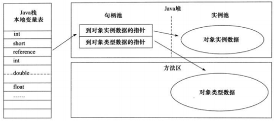
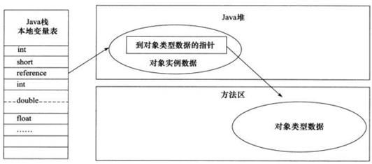

# 对象的创建
Java程序中new一个普通对象需要经过5个步骤：
1. 相应检查和类加载
2. 分配内存
3. 初始化零值
4. 对象头设置
5. 执行<init>方法

## 相应检查和类加载
虚拟机遇到一条new指令时，首先检查这个指令的参数是否能够在常量池中定位到一个类的符号引用，并且检查这个符号引用代表的类是否已被加载、解析和初始化过。如果没有，就必须先执行相应的类的加载过程。
## 分配内存
对象所需内存的大小在类加载完成后便可以确定（JVM可以从对象的类元数据信息确定对象的大小），为对象分配空间的任务等同于把一块确定大小的内存从Java堆中划分出来。

分配方式有两种：
1. 指针碰撞：假设Java堆中的内存是绝对规整的，所有用过的内存放在一边，空闲的内存放在另一边，中间放着一个指针作为分界点的指示器，那分配内存就仅仅是把那个指针向空闲空间那边挪动对象大小的距离，这种方式被称作“指针碰撞”。
2. 空闲列表：如果Java堆中的内存不是规整的，使用的内存和空闲内存相互交错，就不能使用指针碰撞，虚拟机就必须维护一个列表，记录哪些内存块是可用的，在分配的时候从列表中找到一块足够大的空间分配给对象实例就，并对列表进行更新。这种方式叫做“空闲列表”（Free List）。

选择哪种方式由Java堆是否规整决定，Java堆是否规整由所采用的垃圾收集器是否带有压缩整理功能决定。因此，使用Serial、ParNew等带Compact过程的收集器时，采用的是指针碰撞；使用CMS这种基于Mark-Sweep算法的收集器时，采用的是空闲表。
### 线程安全问题
并发时，上述两个操作不是线程安全的，解决方案有两种：
1. 对分配内存空间的动作进行同步处理————实际上虚拟机采用CAS配上失败重试的方式保证更新操作的原子性
2. 把内存分配的动作按照线程划分在不同的空间之中进行，即每个线程在Java堆中预先分配一小块内存，称为**本地线程分配缓冲**（Thread Local Allocation Buffer， TLAB）。 哪个线程要分配内存，就在哪个线程的TLAB上分配，只有TLAB用完并分配新的TLAB时，才需要同步锁定。
## 初始化零值
内存分配完成后，虚拟机需要将分配到的内存空间都初始化为零值（不包括对象头），如果使用本地线程分配缓冲（TLAB），这一工作过程也可以提前到TLAB分配时进行。这一步保证了对象的实力字段在Java代码中可以不赋初值就直接使用，程序能访问到这些字段的数据类型所对应的零值。
## 对象头设置
虚拟机要对对象进行必要的设置。如对象是哪个类的实例、如何才能找到类的元数据信息、对象的哈希码、对象的GC分代年龄等信息。这些信息存放在对象头之中。根据虚拟机运行状态的不同，如是否使用偏向锁等，对象头会有不同的设置方式。
## 执行<init>方法
在上面工作完成之后，从虚拟机的视角来看，一个新的对象已经产生了，但从Java程序的视角来看，对象的工作才刚刚开始————<init>方法还没有执行，所有的字段还都是零值。所以一般来说执行new指令后会接着执行<init>方法，把对象按照程序员的意愿进行初始化。

# 对象的内存布局
在HotSpot虚拟机中，对象在内存中存储的布局可以分为3个区域：**对象头**、**实例数据**、**对齐填充**。
## 对象头
对象头包含两个部分信息，第一个部分用于存储运行时数据，官方称作“Mark Word”，另一个部分是类型指针。
### 运行时数据部分（Mark Word）
这一部分包括哈希码、GC分代年龄、锁状态标志、线程持有的锁、偏向线程ID、偏向时间戳等。
### 类型指针
类型指针即对象指向它的类元数据的指针，虚拟机通过这个指针来确定这个对象时哪个类的实例。并不是所有的虚拟机实现都必须在对象数据上保留类型指针，换句话说，查找对象的元数据信息并不一定需要经过对象本身。如果对象是一个Java数组，那在对象头中还必须有一块用于记录数组长度的数据。
## 实例数据
示例数据部分是对象真正存储的有效信息，也就是程序代码中所定义的各种类型的字段内容。无论是从父类继承下来，还是在子类中定义的，都需要记录下来。

存储顺序受到虚拟机分配策略参数、字段在Java源码中定义的顺序的影响。HotSpot默认的分配策略为longs/double、ints、short/chars、bytes/booleans、oops（Ordinary Object Pointers）。从分配策略中可以看出，相同宽度的字段总是被分配到一起。在满足这个条件的情况下，弗雷中定义的变量会出现在子类之前。如果CompactFields参数值为true（默认为true），那么子类之中较窄的变量也可能会插入到父类变量的空隙当中。
## 对齐填充
对齐填充并不是必然存在的，也没有特别的含义，它仅仅起着占位符的作用，由于HotSpot虚拟机的自动内存管理系统要求对象起始地址必须是8字节的整数倍，也就是说对象的大小必须正好是8字节的整数倍，因此对象实例数据部分没有对齐时，就需要通过对齐填充来补全。

# 对象的访问定位
由于reference类型在Java虚拟机规范中只规定了一个指向对象的引用，并没有对这个引用应该通过何种方式去定位、访问堆中的对象的具体位置，所以对象访问方式也是取决于虚拟机而定的。目前主要有两种方式：
1. 句柄：Java堆中将会划分出一块内存来作为句柄池，reference中存储的就是对象的句柄地址，而句柄地址中包含了对象实例数据和类型数据各自的地址信息。
    
    优点： reference中存储的是稳定的句柄地址，在对象被移动（垃圾收集过程中是普遍的行为）时只会改变句柄的实例数据指针，而reference不变。

2. 直接指针：reference中存储的就是在堆中分配对象实例数据的地址，而对象实例数据中存放了指向方法区中对象类型数据的指针。
    
    优点：速度快，节省了一次指针定位的时间开销，由于对象的访问咋Java中非常频繁，因此这类开销积少成多后也是一项非常可观的执行成本。HotSpot使用的是直接指针。
