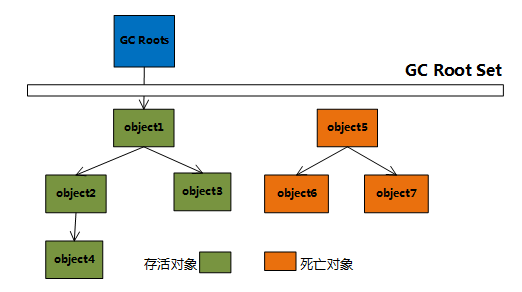

# 概述
垃圾回收（Garbage Collection， GC）的立时比Java久远，1960年诞生于MIT的Lisp是第一门真正使用内存动态分配和垃圾收集技术的语言。

## 垃圾回收需要了解的事情
垃圾回收需要考虑的3件事情：
1. 哪些内存需要回收？即如何判断对象死亡，需要进行回收
2. 什么时候回收？即判定发生在什么时候，需要了解GC的策略，与具体垃圾回收器有关。
3. 如何回收？即垃圾回收算法的具体实现。

## 为什么需要了解垃圾回收
在内存动态分配与内存回收技术相当成熟的现在，一切似乎已经进入了“自动化”时代，为什么需要了解垃圾回收和内存分配？因为在出现下列情况时，我们需要对这些“自动化”的技术实施必要的控制和调节：
1. 在需要排查各种内存溢出、内存泄漏问题时。
2. 当垃圾收集成为系统达到更高并发量的瓶颈时。

## 垃圾回收关注的是内存运行时区域的哪部分
程序计数器、虚拟机栈和本地方法栈3个区域是线程私有的，随着线程而生，随线程而灭，在方法结束或线程结束时，内存自然就跟着回收了。而在Java堆和方法区则不一样，这部分内存的分配和回收都是动态的，垃圾收集器所关注的是这部分内存。

# 判定对象回收
对于对象的回收来说，首先要判定哪些对象时可以回收的，也就是哪些对象已经“死亡”。

主要有两种方法进行判定：
1. 引用计数法
2. 可达性分析算法

## 引用计数法
### 算法思路
1. 给对象中添加一个引用计数器
1. 当有一个地方引用它时，计数器的数值就加1
2. 当引用失效时，计数器的数值减1
2. 任何时刻计数器为0的对象就是不可能再被使用的

### 优点

实现简单、判定效率高、可以很好地解决大部分场景。
### 缺点

很难解决对象之间相互引用的问题。

**主流的Java虚拟机里面没有选用引用计数法来管理内存**
## 可达性分析

### 算法思路
通过一系列的称为“GC Roots”的对象作为起始点，从这些节点开始向下搜索，搜索所走过的路径称为引用链（Reference Chain），当一个对象到GC Roots没有任何引用链相连（用图论的话说就是从GC Roots到这个对象不可达）时，证明此对象是不可用的。

GC Roots的对象包括下面几种：
1. 虚拟机栈（栈帧中的本地变量表）中引用的对象。
2. 方法区中类静态属性引用的对象。
3. 方法区中常量引用的对象。
4. 本地方法栈JNI（即一般说的Native方法）引用的对象。

### 优点
更加精确和严谨，可以分析出循环数据结构相互引用的情况；
### 缺点
实现比较复杂，需要分析大量数据，消耗大量时间；

分析过程需要GC停顿（引用关系不能发生变化），即停顿所有Java执行线程（“Stop The World”）

### 再谈引用
无论是通过引用计数法还是可达性分析法判断对象是否存活都与“引用”有关。
> 在JDK1.2以前：如果reference类型的数据中存储的数值代表的是另外一块内存的起始地址，就称这块内存代表着一个引用。

这种定义很纯粹，但是太过狭隘，一个对象在这种定义下只有被引用和没有被引用两种状态。我们希望能够描述这样一类对象：当内存空间还足够的时候，则能够保留在内存当中；如果内存空间在进行垃圾收集后还是非常紧张，则可以抛弃这些对象。很多系统的缓存功能都符合这样的应用场景。

在JDK1.2后对引用的概念进行了扩充，将引用分为**强引用**（Strong Reference）、**软引用**（Soft Reference）、**弱引用**（Weak Reference）、**虚引用**（Phantom Reference）4种，这4种引用强度依次逐渐减弱。
1. 强引用：强引用就是指在程序代码之中普遍存在的，类似<code> Object obj = new Object() </code>这类的引用，只要强引用还存在，垃圾收集器就永远不会回收掉被引用的对象。
2. 软引用：软引用是用来描述一些还有用，但是并非必需的对象。对于软引用关联着的对象，在系统将要发生内存溢出异常之前，将会把这些对象列进回收范围之中进行第二次回收。如果这次回收还没有足够的内存，才会抛出内存溢出异常。在JDK1.2之后，提供了SoftReference类来实现软引用。
3. 弱引用：弱引用也是用来描述非必需对象的，但是他的强度比软引用更弱一些，被弱引用关联的对象只生存到下一次垃圾收集发生之前。当垃圾收集器工作时，无论当前内存是否足够，都会回收掉只被弱引用关联的对象。在JDK1.2之后，提供了WeakReference类来实现软引用。
4. 虚引用：虚引用也称为幽灵引用或者幻影引用，它是最弱的一种引用关系。一个对象是否有虚引用的存在，完全不会对其生存时间构成影响，也就是无法通过一个虚引用来取得一个对象实例。为一个对象设置虚引用关联的唯一目的就是能在这个对象被收集器回收时收到一个系统通知。在JDK1.2后，提供了PhantomReference类来实现虚引用。

## 判断对象生存还是死亡
要真正宣告一个对象死亡，至少要经历两次标记过程。
### 第一次标记
如果对象在进行可达性分析后发现没有与GC Roots相连接的引用链，那它将会被第一次标记并且进行一次筛选：此对象是否有必要执行finalize（）方法。
+ 没有必要执行：
    1. 当对象没有覆盖finalize（）方法
    2. finalize（）方法已经被虚拟机调用过
+ 有必要执行：如果有必要执行，则将对象放在F-Queue的队列中，并在稍后由一个虚拟机自动建立的、低优先级的Finalizer线程去执行它。

### 第二次标记
finalize()方法是对象逃脱死亡的最后一次机会，稍后GC将对F-Queue中的对象进行第二次小规模的标记。
1. 如果对象重新与引用链上任何一个对象建立关联，比如把自己（this）赋值给某个类变量或者对象成员变量，那在第二次标记时，它将被移除出“即将回收”的集合
2. 如果这时候还没有逃脱，那基本上它就真的被回收了。

一个对象的finalize（）方法只会被系统自动调用一次，经过finalize()方法逃脱死亡的对象，第二次不会被再次执行。

**一般情况应该避免使用finalize（）方法，甚至可以忘记它。**

