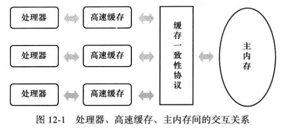
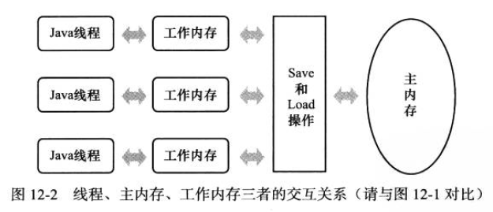

# Java内存模型
Java内存模型（Java Memory Model， JMM）屏蔽掉了各种硬件和操作系统的内存差异，以实现Java程序在各种平台下都达到一致的内存访问效果。

**JMM的主要目标**是定义程序中各个变量的访问规则，即在虚拟机中将变量存储到内存和内存中取出变量这样的底层细节。

此处的变量包括：实例字段、静态字段和构成数组对象的元素，但是不包括局部变量和方法参数，因为后者是线程私有的。

为了获得较好的执行效能，Java内存模型并没有限制执行引擎使用处理器的特定寄存器或缓存来和主内存进行交互，也没有限制即时编译器进行调整代码执行顺序这类优化措施。

Java内存模型与硬件的缓存访问操作具有较高的可比性。



## 主内存和工作内存
Java内存模型规定了所有的变量都存储在主内存中，每条线程还有自己的工作内存，线程的工作内存中保存了被该线程使用到的变量的主内存副本拷贝，线程对变脸的所有操作（读取、赋值）都必须在工作内存中进行，而不能直接读写主内存中的变量。不同线程之间也无法直接访问对方工作内存中的变量，线程间变量值的传递均需要通过主内存来完成。

这里的主内存、工作内存跟Java内存分区中的Java堆、栈、方法区等不是同一个层次的内存划分，这两者之间基本上是没有关系的，如果两者一定要勉强对应起来，那么主内存主要对应于Java堆中的对象实例数据部分，工作内存对应于虚拟机栈中的部分区域。

## 内存间交互操作
Java内存模型定义了8中操作来完成主内存和工作内存之间的数据交换。虚拟机实现时必须保证下面提及的每一种操作都是原子的、不可再分的（对于double和long类型来说，load、store、read和write操作在某些平台上允许有例外）
1. lock（锁定）：作用于主内存的变量，把一个变量标识为一条线程独占的状态。
2. unlock（解锁）：作用于主内存的变量，把一个处于锁定的变量释放出来，释放后的变量才可以被其他线程锁定。
3. read（读取）：作用于主内存的变量，把一个变量的值从主内存传输到线程的工作内存中，便于随后的load操作使用。
4. load（载入）：作用于工作内存的变量，把read进来的变量的值放入工作内存的变量副本当中。
5. use（使用）：作用于工作内存的变量，它把工作内存中一个变量的值传递给执行引擎，每当虚拟机遇到一个需要使用变量的值的字节码指令时将会执行这个操作。
6. assign（赋值）：作用于工作内存的变量，把一个从执行引擎接收到的值赋值给工作内存的变量，每当虚拟机遇到一个给变量赋值的指令时执行这个操作。
7. store（存储）：作用于工作内存的变量，把工作内存中的一个变量的值传递主内存，一遍随后的write操作使用
8. write（写入）：作用于主内存的变量，把store进来的变量的值放入主内存的变量中。

除此之外Java内存模型还规定了再执行上述基本操作时，必须满足如下规则：
1. 不允许read和load、 store和write操作之一单独出现，即不允许从主内存读取工作内存却不载入、工作内存存储主内存却不写入。
2. 不允许线程丢弃它的assign操作，即变量在工作内存改变了必须将变化同步回主内存。
3. 不允许一个线程无原因的将数据从线程的工作内存同步回主内存（没有assign不允许同步）。
4. 一个新的变量只能在主内存中产生，不允许在工作内存中使用一个未被初始化（load或assign）的变量，换句话说，就是对一个变量进行use、store之前，必须先进行assign和load操作。
5. 一个变量在同一个时刻只允许一条线程对其进行lock操作，但是lock操作可以被同一条线程重复执行多次，多次lock后，只有执行相同次数的unlock操作才能解锁。
6. 如果对一个变量执行lock操作，那将会清空工作内存中此变量的值，在执行引擎使用这个变量前，需要重新执行load或assign操作初始化变量的值
7. 如果一个变量事先没有被lock锁定，那就不允许执行unlock操作，也不允许unlock一个被其他线程锁定的操作。
8. 对一个变量执行unlock操作之前，必须先把此变量同步回主内存中（store、write操作）

## volatile关键字
当一个变量定义为volatile之后，它将具备两种特性：
1. 可见性：保证此变量对所有线程的可见性，这里的“可见性”是指，当一条线程修改了这个变量的值，新值对于其他线程时立即可知的。
2. 禁止指令重排序优化
### 可见性
尽管对volatile变量的所有写操作都能立即反应到其他线程中，但是基于volatile变量的运算在并发下并不是安全的。Java运算并非原子操作，导致volatile变量的运算在并发下不安全。如i++操作，在多个线程并发情况下，各个线程中的工作内存的值并不一致，只是各个线程值修改时会立即同步给主内存，让其他线程可见。

在不符合下列两种情况的时候，volatile仍然需要通过加锁来保证原子性：
1. 运算结果并不依赖变量的当前值（i++依赖变量当前值），或者能够确保只有单一的线程修改变量的值。
2. 变量不需要与其他的状态变量参与不变约束。（如start < end就是一个不变式，由两个状态变量组成）
如下面的场景就很适合volatile：
```java
volatile boolean shutdownRequested;

public void shutdown() {
    shutdownRequested = true;
}

public void doWork() {
    while (!shutdownRequest) {
        // do stuff
    }
}
```
### 禁止指令重排序优化
**指令重排序优化**：对于普通的变量仅仅会保证在该方法的执行过程中所有依赖赋值结果的地方都能获取到正确的结果，而不能保证变量赋值操作的顺序与程序代码中的执行顺序一致。

**线程内表现为串行的语义**：因为一个线程的方法执行过程中无法感知到这点，这也就是Java内存模型中描述的所谓“线程内表现为串行的语义”（Within-Thread As-If-Serial Semantics）

有volatile关键字修饰的变量赋值后，多执行了一个<code>lock addl $0x0,(%esp)</code>操作，这个操作相当于一个内存屏障（指重排序时不能把后面的指令重排序到内存屏障之前的位置）

lock指令实际上相当于一个内存屏障（也成内存栅栏），内存屏障会提供3个功能：
1. 它确保指令重排序时不会把其后面的指令排到内存屏障之前的位置，也不会把前面的指令排到内存屏障的后面；即在执行到内存屏障这句指令时，在它前面的操作已经全部完成；
2. 它会强制将对缓存的修改操作立即写入主存；
3. 如果是写操作，它会导致其他CPU中对应的缓存行无效。

### volatile变量与锁
volatile的同步机制的性能确实要优于锁（使用synchronized关键字或java.util.concurrent包里面的锁）但是由于虚拟机对锁实行的许多消除和优化，使得我们很难量化地认为volatile就会比synchronized块多少。

volatile变量读操作的性能消耗与普通变量几乎没有什么差别，但是写操作则可能会慢一些，因为它需要在本地代码中插入许多内存屏障指令来保证处理器不发生乱序执行。不过即便如此，大多数场景下volatile的总开销仍然要比锁低。

是否使用volatile的唯一依据是volatile的语义能否满足使用场景的需求。

### JMM对volatile的特殊规则
Java内存模型中对volatile变量定义了特殊规则，假定T表示一个线程，V和W分别表示两个volatile型变量，那么在进行read、load、use、assign、store和wirte操作时需要满足如下规则：
1. 只有当线程T对变量V执行的前一个动作是load的时候，线程T才能对变量V执行use操作；并且，只有当前线程T对变量V执行的后一个动作是use的时候，线程T才能对变量V执行load动作。线程T对变量V的use动作可以认为是和线程T对变量V的load、read动作相关联，必须连续一起出现。（这条规则要求在工作内存中，**每次使用V前都必须先从主内存刷新最新的值，用于保证能看见其他线程对变量V所做的修改后的值**）。
2. 只有当线程T对变量V执行的前一个动作是assign的时候，线程T才能对变量V执行store操作；并且，只有当线程T对变量V执行的后一个动作是store的时候，线程T才能对变量V执行assign动作。线程T对变量V的assign动作可以认为是和线程T对变量V的store、write动作相关联，必须连续一起出现（这条规则要求在工作内存中，**每次修改V后都必须立刻同步回主内存中，用于保证其他线程可以看到自己对变量V所做的修改**）。
3. 假定动作A是线程T对变量V实施的use或assign动作，假定动作F是和动作A相关联的load或store动作，假定动作P是和动作F相对应的对变量V的read或write动作；类似的，假定动作B是线程T对变量W实施的use或assign动作，假定动作G是和动作B相关联的load或store动作，假定动作Q是和动作G相应的对变量W的read或write动作。如果A优先于B，那么P先于Q（**这条规则要求volatile修饰的变量不会被指令重排序，保证代码的执行顺序与程序的顺序相同**）。

3条规则总结下来就是：
1. 线程使用工作内存的变量前先从主内存刷新这个变量。
2. 线程修改这个变量后立即同步到主内存当中。
3. volatile修饰的变量不会被指令重排序。

## 对于long和double型变量的特殊规则
Java内存模型要求8个操作具有原子性，但是对于64位的数据类型，在模型中定义的相对宽松：允许将没有被volatile修饰的64位数据读写分为两次32位操作来进行，也就不保证原子性，这就是所谓的long和double的非原子协定。

但是目前各种平台的商用虚拟机几乎都选择把64位数据读写操作作为原子操作来对待，因此我们编写代码时不需要把用到的long和double变量专门声明为volatile。

## 原子性、可见性和有序性
1. 原子性：Java内存模型的8个操作大致具有原子性（long、double某些平台除外）。大致可以认为基本数据类型的读写是具备原子性的（例外的是long和double的非原子特性）。

2. 可见性: 可见性是指当一个线程修改了共享变量的值，其他线程能够立即得知这个修改。除了volatile外，final和synchronized也可以实现可见性。同步块的可见性是由“对一个变量执行unlock操作之前，必须把此变量同步回主内存中”这条规则获得。

3. 有序性：Java语言提供了volatile和synchronized两个关键字来保证线程之间操作的有序性。volatile关键字本身就包含了禁止指令重排序的语义，而synchronized则是由“一个变量在同一个时刻只允许一条线程对其进行lock操作”这条规则获得的，这条规则决定了持有同一个锁的两个同步快只能串行的进入。

# 先行发生原则
Java内存模型中的有序性不仅仅是靠volatile和synchronized来完成，还有一个重要的原则：**先行发生原则（happens-before)**。它是判断数据是否存在竞争、线程是否安全的主要依据，依靠这个原则，我们可以通过几条规则一揽子的解决并发环境下两个操作之间是否可能存在冲突的所有问题。

先行发生原则是指，Java内存模型中定义的两项操作之间的偏序关系，如果说操作A先行发生于操作B，那么在操作B发生之前，操作A产生的影响能被操作B观察到，“影响”包括修改了内存中共享变量的值、发送了消息、调用了方法等。

Java内存模型中规定的“天然的”先行发生关系，这些先行发生关系无需任何同步器协助就已经存在，可以在编码中直接使用。如果两个操作之间关系不在此列，并且无法从下列规则中推导出来的话，他们就没有顺序性保障，虚拟机可以对它们随意的进行重排序。
1. **程序次序规则**：在一个线程内，按照程序代码顺序，书写在前面的操作先行发生于书写在后面的操作。准学地说，应该是控制流顺序而不是程序代码顺序，因为要考虑分支、循环等机构。
2. **管程锁定规则**：一个unlock操作先行发生于后面对同一个锁的lock操作。这里必须强调的是同一个锁，而“后面”是指时间上的先后顺序。
3. **volatile规则**：一个对volatile变量的写操作先行发生于对这个变量的读操作，这里的“后面”同样是指时间上的顺序。
4. **线程启动规则**：Thread对象的start（）方法先行发生于此线程的每一个动作。
5. **线程终止规则**：线程中的所有操作都先行发生于对此线程的终止检测，我们可以通过Thread.join()方法结束、Thread.isAlive()的返回值等手段检测到线程已经中止执行。
6. **线程中断规则**：对线程interrupt()方法的调用先行发生于被中断线程的代码检测到中断时间的发生，可以通过Thread.interrupt()方法检测到是否有中断发生。
7. **对象终结规则**：一个对象的初始化完成（构造函数执行结束）先行发生于它的finalize()方法的开始。
8. **传递性**：如果A操作先行发生于B，B操作先行发生于C，那么操作A先行发生于C

一个操作“时间上的先发生”不代表这个操作时先行发生的，一个操作先行发生也不能推导出这个操作是“时间上的先发生”。
```java
\\同一个线程中执行
int i = 1;//操作1
int j = 2;//操作2
```
上述例子中，两个操作在一个线程中发生，满足程序次序规则，操作1先行发生，但是操作2完全可能先被处理器执行，这并不影响先行发生的原则，因为我们在这条线程中没有办法感知到这一点。