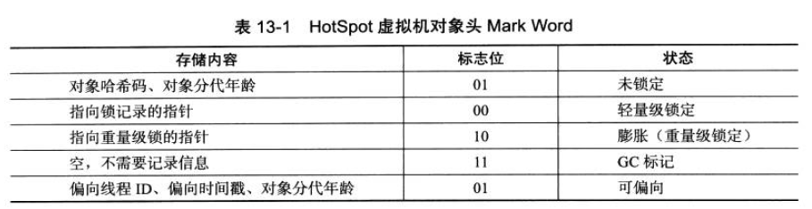
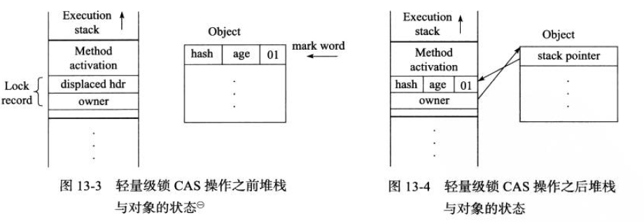
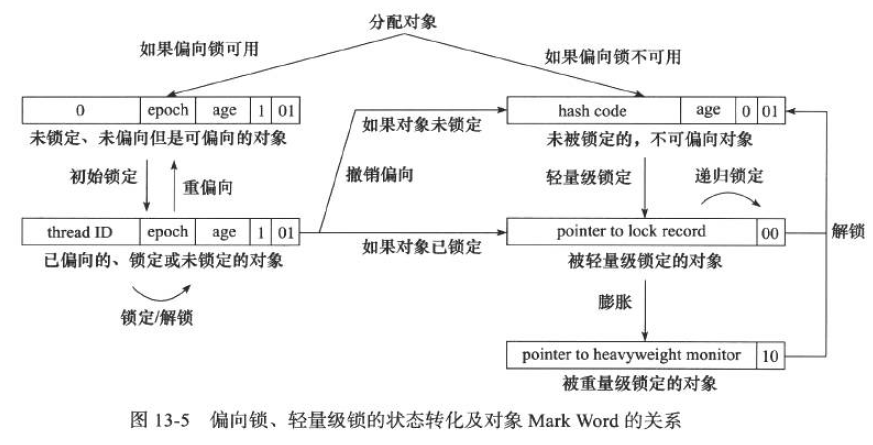

# 线程安全
为了更深入的理解线程安全，可以Java语言中的线程安全按照“安全程度”由强至弱来排序，可以将Java中各种操作共享的数据分为以下5类：
1. 不可变
2. 绝对线程安全
3. 相对线程安全
4. 线程兼容
5. 线程对立

## 不可变
在Java语言中（特指JDK1.5以后，即Java内存模型被修正之后的Java语言），不可变（Immutable）对象一定是线程安全的，无论是对象的方法实现还是方法的调用者，都不需要再采取任何的线程安全保障措施。只要一个不可变的对象被正确的构建出来，那其外部的可见状态永远不会改变。**“不可变”带来的安全性是最简单和最纯粹的**。

+ 针对基本数据类型，只要在定义时使用final关键字修饰就可以保证它是不可变的。
+ 针对对象，需要保证对象的行为不会对其状态产生任何影响才行。

如java.lang.String就是一个不可变对象，调用它的substring()、replace()和concat()这些方法都不会影响原来的值，指挥返回新构造的字符串对象。

保证对象行为不影响自己状态的途径有很多，其中最简单的方法就是把对象中带有状态的变量都声明为final，这样在构造函数结束后，它就是不可变的。如java.lang.Integer的构造函数
```java
private final int value;

public Integer(int value) {
    this.value = value;
}
```
Java API中符合不可变要求的类型，除了String之外，常见的还有枚举类型，以及java.lang.Number的部分子类，如Long和Double等数值包装类型，BigInteger和BigDecimal等大数据类型。

## 绝对线程安全
Brian Goetz给出的绝对线程安全的定义“不管运行时环境如何，调用者都不需要任何额外的同步措施”，这个定义是相当严格的。在Java API中标注自己是线程安全的类，大多数都不是绝对的线程安全。

## 相对线程安全
相对的线程安全就是我们通常意义上所讲的线程安全，它需要保证对这个对象单独的操作时线程安全的，我们在调用的时候不需要做额外的保障措施，但是对于一些特定顺序的连续调用，就可能在调用端使用额外的同步手段来保证调用的正确性。

在Java语言中，大部分的线程安全类都属于这种类型，例如Vector、HashTable、Collections的synchronizedCollection（）方法包装的集合等。

## 线程兼容
线程兼容是指对象本身并不是线程安全的，但是可以通过在调用端正确地使用同步手段来保证对象在并发环境中可以安全地使用，我们平常说一个类不是线程安全的，绝大多数时候指的是这一种情况。
## 线程对立
线程对立是指无论调用端是否采取了同步措施，都无法再多线程环境中并发使用的代码。Java语言中，线程对立这种排斥多线程的代码很少出现，而且通常是有害的，应当尽量避免出现。

如：Thread类的suspend()和resume()方法，如果两个线程同时持有一个对象，一个常识中断，另一个尝试恢复，如果并发进行的话，无论调用时是否进行了同步，目标线程都是存在死锁风险的。也正是由于这个原因suspend()和resume()方法已经被JDK声明废弃了。常见的线程对立操作还有System.setIn()、System.setOut()和System.runFinalizerOnExit()等。

# 实现线程安全
如何实现线程安全与代码编写有很大的关系，但是虚拟机提供的同步和锁机制也起到了非常重要的作用。
## 互斥同步
互斥同步是一种常见的并发正确性保障手段。

**同步**是指在多个线程并发访问共享数据时，保证共享数据在同一时刻只被一个（或者是一些，使用信号量的时候）线程使用。

**互斥**是实现同步的一种手段，临界区、互斥量、信号量、都是主要的互斥实现手段。
### synchronized关键字
最基本的互斥同步手段就是synchronized关键字。synchronized关键字经过编译之后，会在同步块的前后分别形成monitorenter和monitorexit这两个字节码指令，这两个字节码都需要一个reference类型的参数来知名要锁定和解锁的对象。

+ 如果synchronized知名了对象参数，则锁定和解锁的就是这个对象
+ 如果没有明确指定，那就根据synchronized修饰的是类方法还是实例方法，去取对应的Class对象或对象实例来作为锁对象。

synchronized同步块对同一条线程来说是可重入的,不会出现自己把自己锁死的问题。其次同步块在已进入的进程执行完之前，会阻塞后面其他线程的进入。

Java的线程是映射到操作系统的原生线程之上，如果要阻塞或唤醒一个线程，都需要操作系统来帮忙完成，这就需要从用户态转换到核心态中，因此状态转换耗费很多的处理器时间。所以synchronized是Java中的一个重量级操作。

### 重入锁ReentrantLock
除了synchronized之外，我们还可以使用java.util.concurrent（下文称J.U.C）。

ReentrantLock与synchronized很相似，他们都具有可重入特性，只是代码写法上有点区别。一个表现为API层面的互斥锁（lock（）和unlock（）方法配合try/finally语块来完成），另一个表现为原生语法层面的互斥锁。

ReentrantLock增加了一些高级特性：
1. **等待可中断**：等待可中断是指持有锁的线程长期不释放锁的时候，正在等待的线程可以选择放弃等待，改为处理其他事情，可中断特性对处理执行时间非常长的同步块很有帮助。
2. **可实现公平锁**：公平锁是指多个线程在等待同一个锁时，必须按照申请的时间顺序来依次获得锁；而非公平锁不保证这一点，在锁被释放的时候，任何一个等待锁的线程都有机会获得锁。synchronized锁时非公平的，ReentrantLock默认也是非公平的，但是可以通过带布尔变量的构造函数来要求使用公平锁。
3. **锁可以绑定多个条件**：一个ReentrantLock可以同时绑定多个Condition对象，而在synchronized中，锁对象的wait()和notify()或notifyAll()方法可以实现一个隐含的条件，如果要和多于一个条件关联的时候，就不得不额外的添加一个锁，而ReentrantLock不需要这样做，只需要多次调用newCondition()方法即可。

在性能上，JDK1.6发布以后，synchronized和ReentrantLock性能基本上持平了，性能因素不再是选择ReentrantLock的理由了。

## 非阻塞同步
互斥同步最主要的问题就是进行线程阻塞和唤醒所带来的性能问题，因此这种同步也称为阻塞同步(Blocking Synchronization)。

1. **悲观的并发策略**：总是认为只要不去做正确的同步措施（如加锁），那就肯定会出问题，无论共享数据是否真的会出现竞争，它都要进行加锁。
2. **乐观的并发策略**：先进行操作，如果没有其他线程争用共享数据，那操作就成功了；如果共享数据有争用，产生了冲突，那就在采用其他的补偿措施（最常见的补偿措施就是不断的重试，知道成功为止）

互斥同步属于悲观的并发策略，非阻塞同步是乐观的并发策略。

### CAS操作
CAS指令需要有3个操作数，分别是内存位置地址（V）、旧的预期值A和新的值B。CAS指令执行时，当且仅当V符合旧预期值A时，处理器用新的值B更新V所指的内存，否则就不执行更新，但是无论是否更新了V的值，都会返回V的旧值。上述处理过程是一个原子操作。

也就是说赋值之前检查这个变量是否还是原来的值，如果没有发生改变，则进行复制；如果发生改变，那就不进行赋值。

### CAS的“ABA”问题
如果一个变量原来的值为A，在准备赋值的时候检查到它的值还是A，但是我们不能说它没有发生变化，因为它可能由A变成B，又变回了A，但是这样CAS会以为它没有被改变过。

**解决办法**：J.U.C包为了解决这个问题，提供了一个电邮标记的原子引用类“AtomicStampedReference”，它可以通过控制变量的版本来保证CAS的正确性。不过目前这个类比较“鸡肋”，大部分情况下ABA问题不会影响程序开发的正确性，如果需要解决ABA问题，改用传统的互斥同步可能会比原子类更高效。

## 无同步方案
要保证线程安全，并不是一定就要进行同步，两者没有因果关系。同步只是保证共享数据争用时的正确性的手段。如果一个方法本来就不涉及共享数据，那它自然就无须进行任何同步措施去保证正确性，因此会有一些代码天生就是线程安全的。比如下面两类

**可重入代码**：这种代码也叫纯代码（Pure Code），可以在代码执行的任何时刻而中断它，转而去执行另外一段代码，而在控制权返回后，原来的程序不会出现任何错误。

可重入代码有一些共同的特征，例如不依赖存储在对上的数据和公用的系统资源、用到的状态量都是由参数中传入、不调用非可重用的方法等。我们可以用一个简单的原则来看代码是否具有可重入性：如果一个方法，它的返回结果是可以预测的，只要输入了相同的数据，就能返回相同的结果，那它就满足可重入性的要求，当然也是线程安全的。

```java
/**
*这就是一个典型的可重入方法
*无论谁调用它，第几次调用，输出都是一样的
*/
public void test(){
    int i = 0;
    System.out.print(i);
    i++;
    System.out.print(i);
}
```
```java
/**
*这是一个非可重入的代码
*每次调用的结果不一样
*/
public void test(){
    static int i = 0;
    System.out.print(i);
    i++;
    System.out.print(i);
}
```
**线程本地存储**：
如果一段代码中所需要的数据必须与其他代码共享（也就是非可重入代码），那就看看这些共享数据能否保证在同一个线程中执行？如果能保证，就可以把共享数据的可见范围限制在同一个线程之内，这样，就无须同步也能保证线程之间不出现数据争用的问题。

Java语言中，如果一个变量要被多个线程访问，就可以使用volatile关键字声明为“易变的”，如果一个变量要被某个线程独享，Java中可以通过java.lang.ThreadLocal类来实现线程本地存储的功能。

# 锁优化
在JDK1.6上，HotSpot虚拟机开发团队在这个版本上花费了大量的经理去实现各种锁优化技术，如适应性自旋、锁消除、锁粗化、轻量级锁和偏向锁等，这些技术都是为了在线程之间更高效地共享数据，以及解决竞争问题，从而提高执行效率。
## 自旋锁和自适应自旋
互斥同步中对性能最大的影响就是阻塞的实现，线程的挂起和恢复操作都需要转入内核态中完成。但是在许多应用上，共享数据的锁定状态指挥持续很短的时间，为了这很短的时间去对线程进行挂起和恢复并不值得。因此引入了自旋锁。

**自旋锁**：即希望在竞争产生时，并不是立即挂起，而是让线程执行一个忙循环（自旋），避免了线程状态的改变。

可以使用-XX:+UseSpining参数来开启,在JDK1.6中是默认开启的，自旋次数是10次，可以使用参数-XX:PreBlockSpin来更改。

自旋等待本身虽然避开了线程切换的开销，但它需要占用处理器的时间，如果锁被占用的时间段，自旋等待效果就比较好；如果时间长，反而会带来性能浪费。

**自适应自旋**：JDK1.6中引入了自适应的自旋锁。自适应以为这自旋的时间不再固定了，而是由前一次在同一个锁上的紫萱事件及锁的拥有者的状态来决定。

如果在同一个所对象上，自旋等待刚刚成功获得过锁，且持有锁的对象还在运行中，这次自旋很可能再次成功，进而可以将自旋时间延长。如果对于某个锁，很少获得成功，那在以后获取这个锁的时候将可能忽略掉自选过程。

## 锁消除
锁消除是指虚拟机即时编译器在运行时，对一些代码上要求同步，但是被检测到不可能存在共享数据竞争的锁进行消除。锁消除的主要判定依据来源于逃逸分析的数据支持。

## 锁粗化
如果一串连续的操作对同一对象加锁、解锁，那么虚拟机将会把锁的同步范围扩展（粗化）到整个操作序列的外部。

## 轻量级锁
轻量级锁时JDK1.6加入的新型锁机制，传统的锁机制称为“重量级锁”。轻量级锁不是用来代替重量级锁的，它的本意是在没有多线程竞争的前提下，减少传统重量级锁使用操作系统互斥量产生的性能消耗。
### 关于对象头
HotSpot虚拟机对象头分为两个部分：
1. 第一部分 用于存储对象自身的运行时数据，如哈希码、GC分代年龄等，官方称作“Mark Word”
2. 第二部分 存储执行方法区对象类型的指针，如果是数组对象，还会有一个额外的部分用于存储数组长度。

Mark Word被设计成一个非固定的数据结构，以便在极小的空间内存储尽量多的信息，它会根据对象的状态复用自己的存储空间。总长度在32位和64位虚拟机中分别为32位和64位。


在代码进入同步块的时候，如果此同步的对象没有被锁定，虚拟机首先将在当前线程的栈帧中建立一个名为所记录的空间，用于存放对象目前Mark Word的拷贝（即Displaced Mark Word），这时线程堆栈与对象头的状态如图13-3所示。

然后，虚拟机使用CAS操作尝试将对象的Mark Word更新为执行Lock Record的指针。如果成功，那么这个对象就拥有了这个对象锁，并且对象Mark Word的锁标志位转为“00”，表示对象处于轻量级锁定状态。


如果更新操作失败，虚拟机会检查对象的Mark Word是否指向当前线程的栈帧，如果指向，说明当前线程已经拥有了这个而对象的锁，那就可以直接进入同步块继续执行，否则说明这个对象已经被其他线程抢占了。

如果有两条以上的线程争用同一个锁，那轻量级锁就会膨胀为重量级锁，锁标志位“10”，Mark Word中存储的就是指向重量级锁的指针，后面等待锁的线程也要进入阻塞状态。

轻量级锁使用CAS操作避免了使用互斥量的开销，但如果存在锁竞争，除了互斥量的开销外，还额外发生了CAS操作，因此在有竞争的情况下，轻量锁会比传统的重量级锁更慢。

## 偏向锁
翩跹锁的目的是消除数据在无精症情况下的同步原语，进一步提高运行性能。如果说轻量级锁时在无精症的情况下，使用CAS操作去消除同步使用的互斥量，那么偏向锁就是在无竞争的情况下，将整个同步过程都消除了，连CAS操作都不需要了。

当对象第一次被线程获取的时候，虚拟机将会把对象头中的标志位设为“01”，即偏向模式，同时使用CAS操作把获取到这个对象的线程ID记录在对象的Mark Word中，如果CAS操作成功，持有偏向锁的线程以后每次进入这个锁相关的同步块时，虚拟机可以不再进行任何同步操作。

当有另外一个线程尝试获取这个锁时，偏向模式结束。根据锁对象目前是否处于被锁定状态，撤销偏向后恢复到未锁定状态或轻量级锁定状态。


## 个人对偏向锁、轻量级锁、重量级锁理解
1. 偏向锁：使用于没有竞争的情况，有一个线程经常来，偏向它，方便后续它来的时候，减少操作。
2. 轻量级锁：适用于多线程，但是没有竞争的情况，就是说，有多个线程，但是这一块他们是交替着来的。
3. 重量级锁：多线程，有竞争。