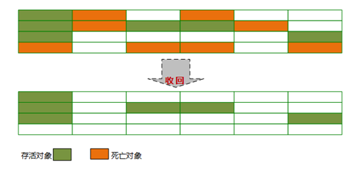
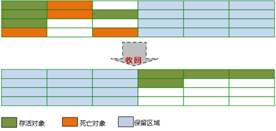
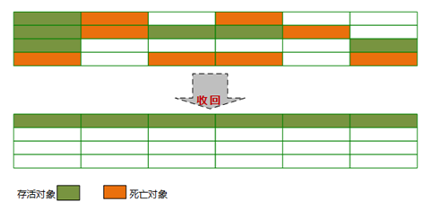

# 标记-清除算法
## 算法思路
标记-清除算法是最基础的收集算法，算法分为“标记”和“清除”两个阶段：
1. 首先标记出所有需要回收的对象。
2. 在标记完成之后统一回收所有被标记的对象。

标记-清除法的过程如下：

## 优缺点
### 优点
基于最基础的可达性分析算法，是最基础的收集算法，后续的算法都是基于这种思路并对其不足之处进行改进得到的。
### 缺点
的主要不足之处有两个：
1. 效率问题，标记和清除两个过程的效率都不高
2. 空间问题，标记清除之后会产生大量的不连续的内存碎片，空间碎片太多可能会导致以后再程序运行过程中需要分配较大对象时，无法找到足够的连续内存，从而不得不提前触发另一次垃圾收集动作。

# 复制算法
为了解决效率问题，提出了“复制”算法。
## 算法思路
1. 将内存按容量划分为大小相等的两块，每次只使用其中的一块
2. 当这一块的内存用完了，将还存活的对象复制到另一块上面，然后把这一块内存一次清除掉。

执行过程如下图所示：

## 优缺点
### 优点
1. 每次只对整个半区进行回收，内存分配时不用考虑内存碎片问题
2. 实现简单，运行高效

### 缺点
1. 空间浪费，内存缩减为原来的一半，太过浪费
2. 效率随对象存活率升高而变低，当对象存活率较高时，需要进行较多的复制操作。

## HotSpot改良
IBM公司的专门研究表明，新生代中对象98%是“朝生夕死”的，所以并不需要按照1:1的比例进行分寸划分。

** HotSpot虚拟机新生代内存划分**：
1. 将新生代划分为一块较大的Eden空间和两块较小的Survivor空间
2. 每次使用Eden和其中一块Survivor
3. 当回收时，将Eden和使用的Survivor中还存活的对象复制到另外一块Survivor中
4. 清除掉Eden和使用过的Survivor空间
5. 后面就使用Eden和复制到的那一个Survivor

**默认Eden：Survivor = 8:1，即每次可以使用90%的空间，只有一块Survivor被浪费**

6. 分配担保：如果另一块Survivor没有足够的空间存放存活的对象，这些对象将直接通过分配担保机制进入老年代。

# 标记-整理法
标记-整理算法是针对老年代的特点提出的。

复制收集算法在对象存活率较高的时候就要进行较多的复制操作，效率将会变低。如果不想浪费50%空间，就需要有额外的空间进行分配担保，以应对被使用的内存中所有对象都存活的极端情况，所以不符合老年代。
## 算法思路
1. 标记过程和“标记-清除”算法一样
2. 整理过程：标记结束后不是直接对可回收对象进行清除，而是让所有存活的对象都向一端移动，然后直接清除掉边界意外的内存。

执行过程如下图所示：

## 优缺点
### 优点
1. 不会产生内存碎片
2. 不会因为对象存活率高降低效率，老年代对象存活率高

### 缺点
1. 主要还是效率问题:相比“标记-清除”法，多了整理过程，效率更低。

# 分代收集算法
当前商业虚拟机的垃圾收集都采用“分代收集”算法，结合不同算法收集不同的区域。
## 算法思路
根据对象存活周期不同，将内存划分为几块，根据每块的特点，使用不同的垃圾收集算法。一般把Java堆分为新生代和老年代。
### 新生代
新生代每次垃圾收集时，都发现有大批对象死去，只有少量存活。

可以选用**复制算法**，只需要付出少量存活对象的复制成本就可以完成收集。

### 老年代
老年代中对象存活率高，没有额外的空间进行分配担保，必须使用**标记-清除**法或者是**标记-整理**

# HotSpot的算法实现
## 枚举根节点
枚举根节点的时间敏感，作为GC Roots的节点主要在全局性的引用（如常量和静态属性）与执行上下文（如栈帧中的本地变量表）中，现在很多应用仅仅方法区就有数百兆，如果要逐个检查这里面的引用，那么必然会消耗很多时间。

枚举根节点的时间敏感性还体现在GC停顿上。

**GC停顿**：可达性分析必须在一个能保证一致性的快照中进行————这里“一致性”的意思是指在整个分析期间整个执行系统看起来就像被冻结在某个时间点上，不可以出现分析过程中对象引用关系还在不断变化的情况，该点不满足的话，分析结果准确性就无法保证。这点是导致GC进行时必须停顿所有Java执行线程（Sun称为“Stop The World”）的其中一个重要原因。

**OopMap数据结构**：HotSpot使用一组称为OopMap的数据结构来使虚拟机直接得知哪些地方存放着对象引用，使得虚拟机并不需要一个不漏地检查完所有执行上下文和全局的引用位置。

在类加载完成的时候，HotSpot就把对象内什么偏移量上是什么类型的数据计算出来，在JIT编译过程中，也会在特定的位置记录下栈和寄存器中哪些位置是引用，这样GC在扫描时就可以直接得知这些信息了。

## 安全点
### 什么是安全点
运行中有有许多指令会导致引用变化，如果为这些指令都生成OopMap，需要的空间成本太高。

为了减少空间成本，HotSpot没有为每条指令都生成OopMap，只是在“特定的位置”记录了这些信息，这些位置称为“安全点”。即程序并非在所有地方都能停顿下来开始GC，只有到达安全点时才能暂停。

### 安全点的选定
1. 安全点的选定不能太少以至于导致让GC等待时间太长
2. 安全点的选定也不能过于频繁以至于频繁GC增大运行时的符合。

选定标准：**是否具有让程序长时间执行的特征**

长时间执行的最明显特征：**指令序列复用**，如调用、循环跳出、异常跳转等，所以具有这些功能的指令才会产生安全点。

### 如何在安全点停顿
1. 抢先式中断：不需要线程的执行代码主动去配合，在GC发生时，首先把所有线程全部中断，如果发现有线程中断的地方不在安全点上，就恢复线程，让它“跑”安全点上。现在几乎没有虚拟机采用这种方式来暂停线程从而响应GC事件。
2. 主动式中断：当GC需要中断时，不直接对线程操作，仅仅简单地设置一个标志位，各个县城执行时主动的轮询这个标志，发现中断标志为真时，就自己中断挂起。轮询标志的地方和安全点时重合的。

## 安全区域
### 为什么需要安全区域
安全点保证了程序执行时，在不太长的时间内就会遇到可进入GC的安全点。但是在程序不执行时也就是没有分配CPU时间（线程Sleep状态、Blocked状态），这时候线程无法响应JVM的中断请求，运行到安全点去进行中断挂起。这时就需要安全区域。

### 安全区域的概念
安全区域是指在一段代码片段中，引用关系不会发生变化。在这个区域中的任意地方开始GC都是安全的。可以看做是安全点的扩展
### GC过程
+ 线程进入安全区域中的代码时，标记自己进入Safe Region，在这段时间JVM发起GC时，就不用管标记自己为Safe Region的线程。
+ 线程离开安全区时，检查系统是否完成了根节点枚举（或者整个GC过程）
+ 如果完成，就继续执行
+ 如果没完成，就等待知道收到可以安全离开安全区域的信号为止

【参考资料】
1. Java虚拟机垃圾回收（二）https://blog.csdn.net/tjiyu/article/details/53983064
2. 《深入理解Java虚拟机：JVM高级特性与最佳实践》第二版 第3章