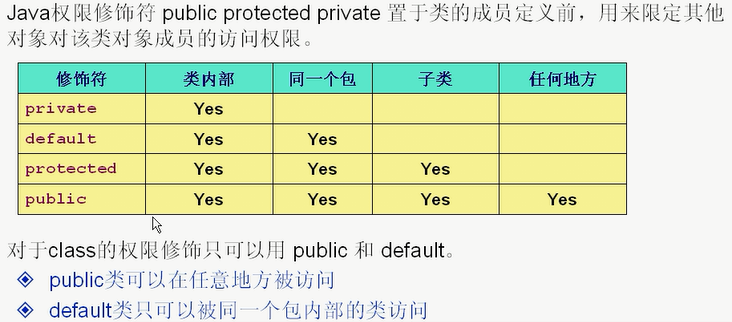

# 抽象类
+ 用abstract关键字来修饰一个类时，这个类叫做抽象类。
+ 用abstract来修饰一个方法时，这个方法叫做抽象方法。
+ 含有抽象方法的类必须被声明为抽象类，抽象类必须被继承，抽象方法必须被重写。
+ 抽象类不能被实例化。
+ 抽象方法只需声明，而不需实现。
+ 抽象类里面的抽象方法必须被子类全部实现，如果不能全部实现，那么子类必须是抽象类。
# Final关键字
+ final变量的值不能够被改变。
    + final的成员变量
    + final的局部变量（形参）
+ final的方法不能被重写。
+ final的类不能被继承。
    如String、Math都是public final类，不能被继承。
+ 类中的所有private方法都隐式地指定为final。

# 接口
+ 接口可以实现多重继承
+ 接口中声名的属性默认为public static final;也只能是public static final
+ 接口中只能定义抽象方法，这些方法默认为public，也只能是public
+ 接口可以继承其他的接口，并添加新的属性和抽象方法。
+ 多个无关类可以实现同一个接口
+ 一个类可以实现多个无关接口

# 多态与重载
## 方法重载（Overload）
方法名相同，参数类型列表不同
```java
void fun(int i);
void fun(String str);
```
## 方法覆盖（Override）
父类和子类有相同的方法名和参数类型列表
```java
class Parent{
    void fun(){
        System.out.println("Parent fun()");
    }
}

class Child extends Parent{
    void fun() {
        System.out.println("Child fun()");
    }
}
```
使用父类引用指向子类对象，调用方法时会调用子类的方法实现，而不是父类方法的实现。
```java
Parent instance = new Chile();
instance.fun();//调用的是子类的fun()
```

# Java初识化
1. 先执行父类静态变量和静态代码块，再执行子类静态变量和静态代码块。
2. 先执行父类普通变量和代码块，再执行父类构造器
3. 先执行子类普通变量和代码块，再执行类构造器

# 访问权限：
